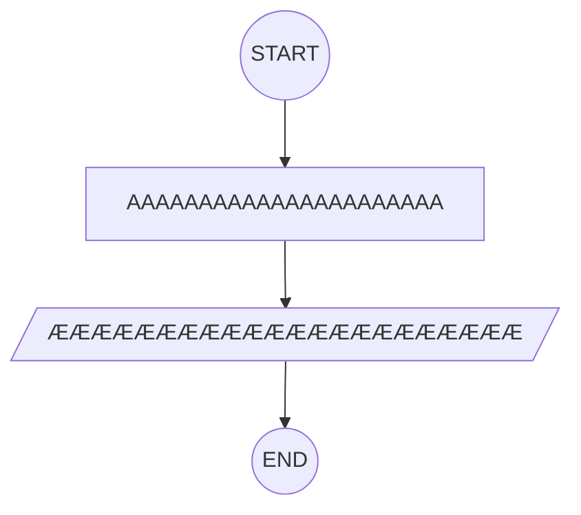

```mermaid
flowchart TD
z((START))-->a
a["AAAAAAAAAAAAAAAAAAAAAA"]-->b[/"ÆÆÆÆÆÆÆÆÆÆÆÆÆÆÆÆÆÆÆÆÆÆ"/]
b-->c(("END"))
```
<!---
Askemanden/Askemanden is a ✨ special ✨ repository because its `README.md` (this file) appears on your GitHub profile.
You can click the Preview link to take a look at your changes.
--->
